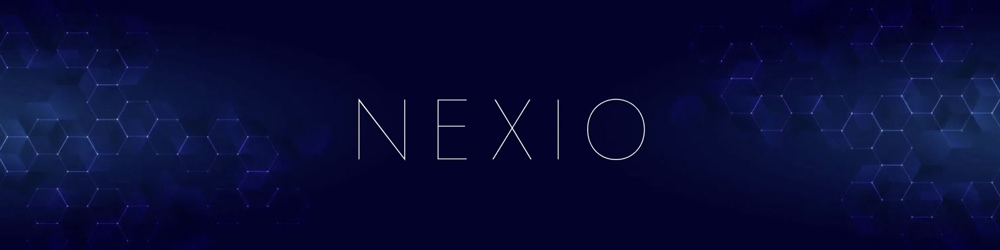

# Welcome to NEXIO 🚀

## About Us ✨

At **NEXIO**, we are a driving force for innovation, creativity, and technological transformation. Founded on the belief that the future belongs to those who build it, NEXIO is committed to shaping the digital landscape of tomorrow.

Our mission is simple but powerful: to **push boundaries** and **elevate industries** through cutting-edge software solutions. From pioneering **next-gen technologies** to designing bespoke applications that solve real-world problems, we are focused on creating a smarter, more connected future.

NEXIO thrives on visionary thinking, and our team is built from the ground up to reflect that mindset. We are a collective of innovators, developers, and designers who embrace challenges, drive change, and deliver exceptional results. We’re not just coding solutions; we’re crafting the **future of technology**.

### What We Do Best 🌟

- **Innovative Software Solutions** 💻: We design and build custom applications that are intuitive, scalable, and ready for the future.
- **Emerging Technologies** 🚀: We integrate the latest advancements in AI, machine learning, IoT, and blockchain to offer unparalleled digital solutions.
- **Creative Problem-Solving** 🎨: Innovation is at the core of everything we do. We create elegant solutions to complex challenges by blending technology and creativity.
- **Future Impact** 🌍: We are committed to creating technology that has a meaningful, lasting impact on both businesses and society.

### Our Vision 🌠

To become a **leading force** in digital innovation globally, driving transformational growth by delivering **revolutionary software** that reimagines the possibilities of the digital world.

We see a future where **technology empowers** people, enhances businesses, and drives sustainable change. As we look ahead, NEXIO is poised to be at the forefront of that future — helping to build a world where the impossible becomes the everyday.

---

🌟 **Join us** in our journey to build the next great wave of innovation. Let’s shape the future together.
